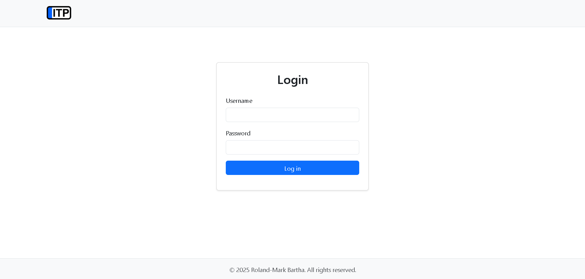
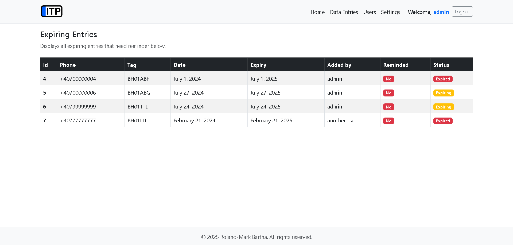
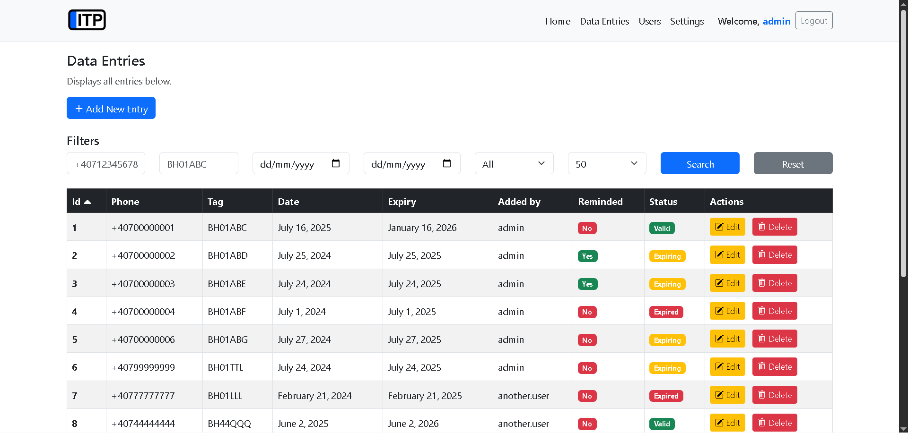
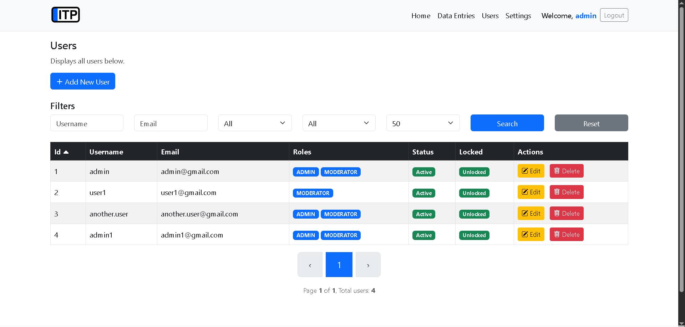
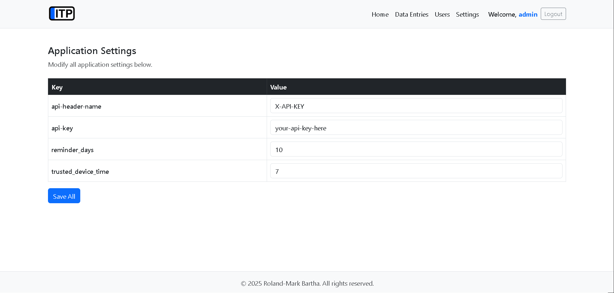
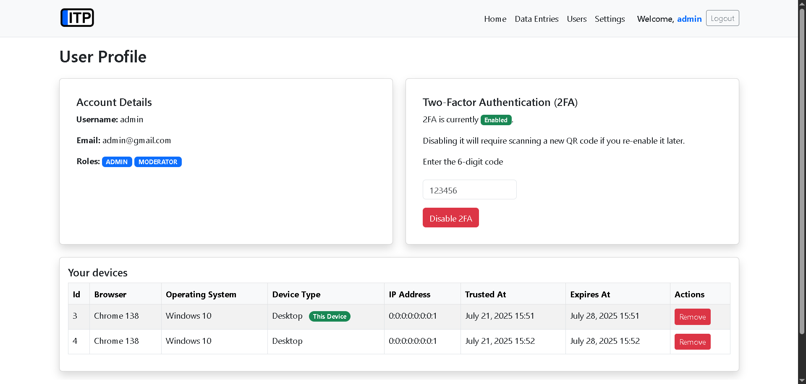

# 📦 ITP Reminder (PTI Reminder)

A full-featured Spring Boot web application to manage expiring periodic technical inspections of vehicles, send SMS reminders, and provide secure, admin-level control over users and data — designed as a **portfolio project** to showcase real-world Java backend development skills using a **CI/CD Pipeline** - currently in production to help a company digitalize.

---

## 📱 Platforms

- 🖥️ **Web App** – Built with Thymeleaf + Spring Boot

- 📲 **Mobile App** – Built with Android

---

## ✨ Features

### 🖥️ Web App

- 🛡️ **Security**
  - Login & optional *Two-Factor Authentication (2FA)* using a mobile authenticator app
  - Configurable *Trusted Device* feature for *2FA*
  - *Account locking* for too many failed login/2fa attempts
- 🧾 **Data Management**
  - Add, update, delete entries with phone, tag, and due date
  - *Filter* and *search* with *pagination*, *sorting*, and date range
  - Import & export data in XLSX format
  - REST API for Mobile App (with configurable header & API key)
- 🛠 **Admin Dashboard**
  - View and manage *users* & *settings*
  - *Role-based* access control
- 📊 **Pagination & Search**
  - Dynamic filtering with *Thymeleaf + Spring Data JPA*
  - Mobile-friendly UI with *Bootstrap*

### 📱 Mobile App

- 🛡️ **Security**
  - *API key & header* required (managed by 🖥️ Web App administrators)
- 🛎 **Reminder System**
  - *Custom SMS* message with placeholders
  - Manual *SMS reminders* using default SMS manager (updates 🖥️ Web App upon sending)
- 🎨 **UI**
  - Modern navigation & layout
  - *Refresh gesture* to update entries (**swipe down**)

---

## 🖼 Screenshots

| Login | Home | Data Entries | Users | Settings | Profile |
|------------|------------|------------|------------|------------|------------|
|  |  |  |  |  |  |

---

## ⚙️ Tech Stack

| Backend         | Frontend          | Security             | Database      |
|----------------|-------------------|----------------------|---------------|
| Java 17         | Thymeleaf (HTML/CSS/JS) | Spring Security w/ 2FA & TD |  |
| Spring Boot     | Bootstrap 5       | Mobile Authenticator | Spring Data JPA |
| Gradle          |                   |                      |               |

---

## 🚀 Getting Started

### Prerequisites

- Java 17+
- Gradle
- Database

### Clone & Run

```bash
git clone https://github.com/rolibrt/itp-reminder.git
cd itp-reminder/web
./gradlew bootRun
```

Then visit: `http://localhost:8000`

---

## 🔐 Login Credentials (Demo)

| Role     | Username | Password |
|----------|----------|----------|
| Admin    | `admin`  | `admin123` |
| User     | `user`   | `user123` |

You can enable 2FA after login via the profile page.

---

## 🧪 Testing

- JUnit tests included for services and security
- Easily extendable for integration tests

---

## 📁 Project Structure

```
project-root/
├── web/                                           # Spring Boot web app (admin panel, API, etc.)
│   └── src/
│       └── main/
│           ├── java/
│           │   └── net.rolibrt.itp_reminder/
│           │       ├── auth/                      # Login, 2FA, TD
│           │       ├── components/                # Login, SecurityConfig, 2FA
│           │       ├── config/                    # Resource & Security Config
│           │       ├── controllers/               # Web controllers
│           │       ├── dtos/                      # DTOs for filtering, pagination, etc.
│           │       ├── models/                    # JPA entities (User, DataEntry, etc.)
│           │       ├── repositories/              # Spring Data JPA interfaces
│           │       └── services/                  # Application services
│           └── resources/
│               ├── static/                        # CSS, JS & images
│               ├── templates/                     # Thymeleaf templates (views)
│               └── application.properties         # Configuration
│
├── mobile/                                        # Android Mobile app
│   └── app/                 
│       └── src/
│           └── main/
│               ├── java/
│               │   ├── net.rolibrt.itp_notifier/  # App-level source code
│               │   └── AndroidManifest.xml        # Mobile entry point / permissions
│               └── res/                           # Resources: layouts, drawables, icons
│
└── README.md
```

---

## ✅ Why This Project?

I created this project to level up my full-stack development skills and have something solid to showcase in my portfolio. It’s a full-featured web app (built with Spring Boot and Thymeleaf) that makes it easy to manage and filter data entries — plus, there's a companion Android app for sending reminder notifications.

What makes it stand out:
- Clean UI with dynamic filtering, sorting, and pagination.
- Optional 2FA with trusted device support to make login both secure and convenient.
- A mobile app that lets you manually send SMS reminders.
- Core features like create/edit/delete, date filtering, and reminder tracking.

This project helped me bring together backend logic, frontend usability, and mobile integration — all while focusing on clean code and a good user experience. It’s something I’d actually use, and that’s what makes it portfolio-worthy.

---

## 📚 Future Improvements

There’s still plenty of room to grow! Some planned features and ideas:

- ~~📱 Responsive UI~~
- ~~🔐 Two-Factor Authentication with Trusted Devices support~~
- ✉️ **Email Sending**: News, security alerts, 2FA.
- 📊 **Admin Analytics**: Dashboards for visualizing usage, activity, and reminders.
- ⬇️⬆️ **Data Export/Import**: Support for backing up or migrating data via CSV or JSON.
- 🔐 **Session Management**: Track active sessions and user activity.
- 📜 **User Logs**: Let admins view login history, 2FA activity, and key user actions.

---

## 👨‍💻 Author

**Roland-Mark Bartha**  
Java Developer | Spring Boot | Portfolio Project

- LinkedIn: [linkedin.com/in/roland-mark-bartha](https://www.linkedin.com/in/roland-mark-bartha-574526223/)
- GitHub: [github.com/rolandbartha](https://github.com/rolandbartha)

---

## 📄 License

This project is open-source and available under the [Apache License 2.0](LICENSE).
